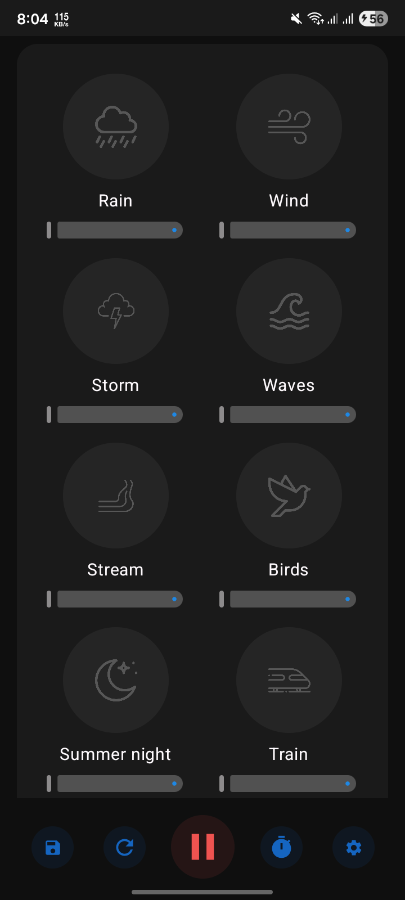
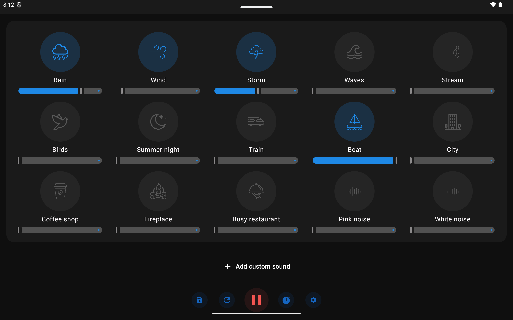

# Blankee

**Listen to different sounds**

<br>

[](https://github.com/itsPronay/napify/blob/main/LICENSE)
[](https://www.android.com)
[](https://kotlinlang.org)

<p align="center">
  
</p>

**If you wanna see how it looks on Android tablet:**

<p align="center">
  
</p>

## Description

Improve focus and increase your productivity by listening to different sounds. Blankee can also be used to help you to fall asleep in a noisy environment. Mix multiple ambient sounds with individual volume controls to create your perfect soundscape.


## Features

- **Multiple Ambient Sounds** – Rain, waves, fireplace, forest, wind, and more
- **Sleep Timer** – Automatic shutdown for hands-free relaxation
- **Custom Sounds** – Upload your own audio files 
- **Save Presets** – Create and save your favorite combinations for quick access
- - **Dark & Light Mode** – Full theme support for comfortable use
- **Multilingual** – English, Spanish, Bengali, Hindi supported
- **Individual Volume Controls** – Mix and match sounds to your preference
- **Responsive Design** – Works beautifully on phones, tablets, and foldable devices

## Installation

<!-- ### Google Play Store

<a href="https://play.google.com/store/apps/details?id=com.pronaycoding.blankee"></a> -->

### GitHub Releases

Download the latest APK from [GitHub Releases](https://github.com/itsPronay/napify/releases)

### Build from Source

#### Requirements

- Android API Level 24+ (Android 7.0)
- Kotlin 1.9+
- Jetpack Compose
- Gradle 8.0+

#### Build Instructions

```bash
# Clone the repository
git clone https://github.com/itsPronay/napify.git
cd napify

# Build the app
./gradlew build
```

## Translations

Blankee is translated into several languages:
- 🇬🇧 English
- 🇪🇸 Spanish  
- 🇧🇩 Bengali
- 🇮🇳 Hindi

If your language is missing or incomplete, contributions are welcome!

## Contributing

We welcome open-source contributions! You can:

- 🐛 Report bugs
- 💡 Suggest features
- 🔧 Submit pull requests
- 🌍 Help with translations
- ⭐ Star this repository

## Credits

Developed by **[Pronay Sarker](https://github.com/itsPronay)** and [contributors](https://github.com/itsPronay/napify/graphs/contributors).

For detailed information about sounds licensing, [see this file](SOUNDS_LICENSING.md).

<p align="center">
  Made with ❤️ by Pronay for focus, relaxation, and better sleep
</p>
